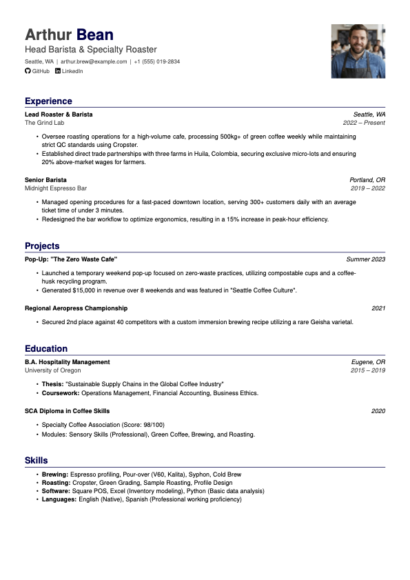

# mincv


**mincv** is a minimalistic, single-page LaTeX CV class designed for readability and simplicity. It features a clean two-tone header, automatic handling of missing data fields, and typography optimized for ATS systems.



## Usage

1.  Ensure `mincv.cls` is in the same directory as your `.tex` file.
2.  Load the class and set your details:

```latex
\documentclass{mincv}

\cvname{Arthur}{Bean}
% \cvjob{Head Barista \& Specialty Roaster} % Optional: Comment out to hide
...

\begin{document}
\makecvheader
...
\end{document}